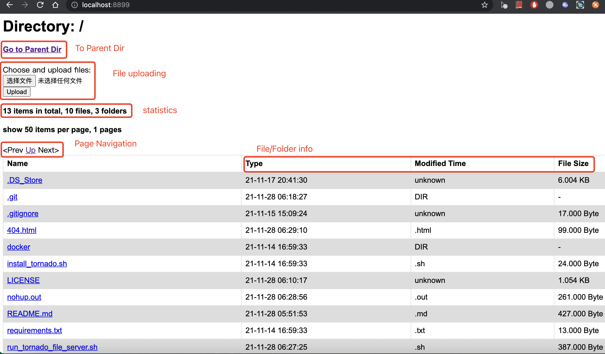

# A Tornado-based File Server

## Features

1. show files on multiple pages;
2. page navigation (to prev/up/next);
3. file uploading;
4. show file statistics (how many fils/folders);
5. show file info: type/modification time/size;

## Sceenshot

 
[Screenshot](https://github.com/walkoncross/tornado-file-server/blob/master/screenshot_for_tornado_file_server.png) 

## Python version

Should work with python>=2.7.

Tested Python version: 
- Python 2.7
- Python 3.9

## How-to

### Use 'pip install'

1. install package
```
pip install git+https://github.com/walkoncross/tornado-file-server
```
2. start serving:
```cmd
python -m tornado_file_server.serving --port 8899 _your_root_dir_
```
or just run ./run_tornado_file_server.sh

3. In your internet browser, for local test, put: http://localhost/8899; for public url, put http://_your_binded_public_url_

###  Use source code

1. install tornado: 
```cmd
pip install tornado>=4.5;
```

2. git clone this repo;

3. start serving:
```cmd
python -m tornado_file_server.serving --port 8899 _your_root_dir_
```
or just run ./run_tornado_file_server.sh

4. In your internet browser, for local test, put: http://localhost/8899; for public url, put http://_your_binded_public_url_